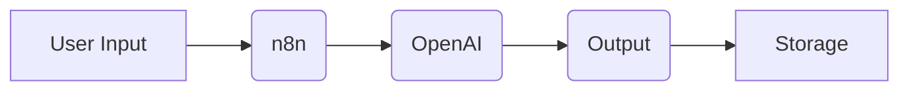

# AI Content Automation System

This project demonstrates an automation workflow for generating structured content using AI.

## Overview

The system uses n8n and OpenAI API to automate content creation from predefined topics.

## Features

- Automated content generation
- Scalable workflow design
- Prompt-based architecture
- Integration-ready outputs

## Tech Stack

- n8n
- OpenAI API
- Google Sheets

## Workflow

1. Topic is added to database
2. Workflow is triggered
3. AI generates content
4. Output is saved for use

## Example Output

"Topic: Productivity tips for entrepreneurs"

"Post:
Struggling with productivity? Start by eliminating decision fatigue..."

## Purpose

Built to demonstrate practical use of AI in workflow automation and digital systems.

## Status

Work in progress – initial functional version

## Author

Absalão – Automation & AI Workflow Specialist
## Real Use Case

This system can be used by:
- Content creators
- Marketing teams
- Small businesses

To automate content production and reduce manual effort.
graph LR
    A[User Input] --> B(n8n)
    B --> C(OpenAI)
    C --> D(Output)
    D --> E[Storage]
    ### Fluxo de Integração

## Technical Details

- Uses API-based communication with OpenAI
- Modular workflow design
- Easily extendable for multi-channel publishing
## Challenges

- Handling prompt consistency
- Ensuring output quality
- Designing scalable workflows
